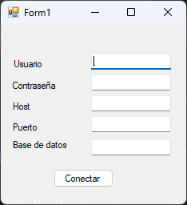
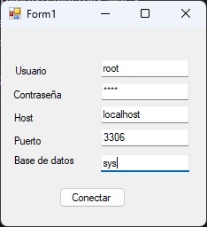
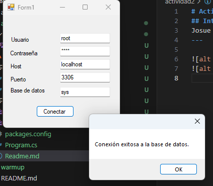
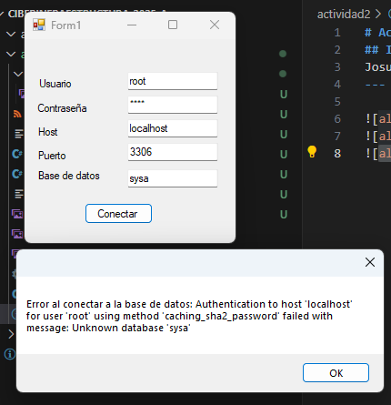
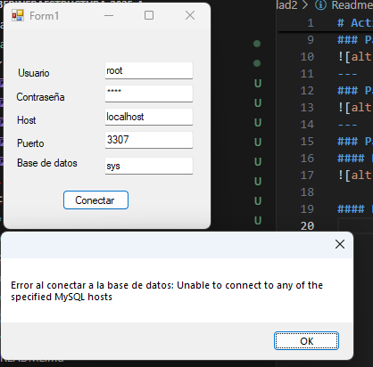
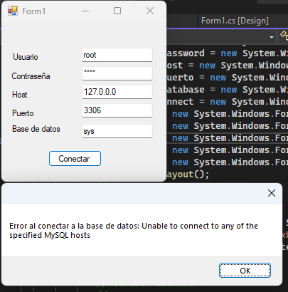
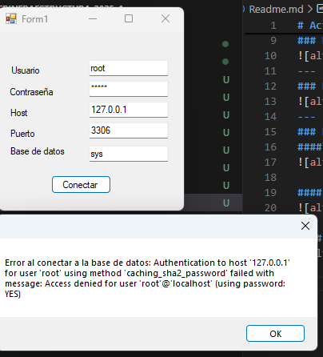
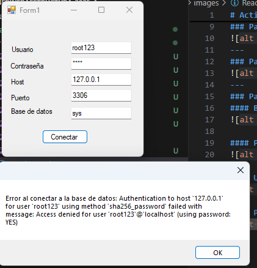

# Actividad 2 
## Interfaz gráfica con conexión a MySQL
Josue Norberto Aguilar Islas
--- 

### Pantalla de inicio

---
### Pantalla con datos

---
### Pantallas con datos correctos 

---
### Pantallas con datos erroneos
#### Base de datos erronea

#### Puerto erroneo

#### Usando ip 127.0.0.0 (IP erronea)

#### Password erronea

#### User erroneo
